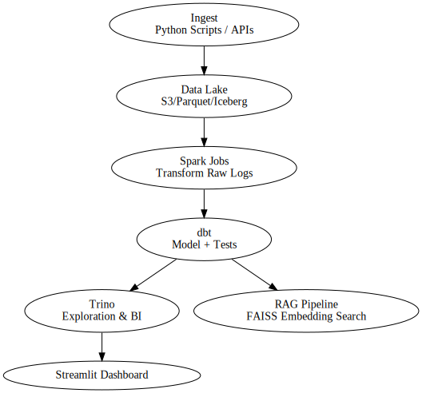

# 🚀 Telemetry Lakehouse: AI-Ready Product Usage Platform

[]()
[]()
[]()
[]()

**Simulate, analyze, and augment product telemetry data at scale using modern lakehouse tools. Built with Trino, Spark, dbt, and FAISS for AI-powered discovery and analytics.**

---

## 📌 Features

- 🪣 **Lakehouse Design**: Trino + Spark over Parquet with modular dbt models
- 🔁 **Orchestrated Pipelines**: Compatible with Airflow or Dagster
- 📊 **Self-Service Exploration**: Trino SQL + Streamlit dashboard
- 🤖 **AI-Ready**: RAG pipeline using FAISS for vector search over event logs
- 🧪 **Tested & Modular**: dbt tests, Pytest, and CI-ready structure
- ☁️ **Infra-as-Code**: Terraform scripts to provision S3, Trino, and Airflow

---

## 🗺 Architecture



---

## 🧬 Entity Relationship Diagram


---

## 📂 Project Structure

```
telemetry-lakehouse/
│
├── data/                  # Sample event logs
├── ingestion/             # Simulated API scripts
├── pipelines/             # Airflow DAGs, Spark jobs
├── dbt/                   # dbt models and metrics
├── warehouse/             # Trino queries
├── mlops/                 # RAG pipeline w/ FAISS
├── infra/                 # Terraform deployment
├── streamlit_app/         # Optional UI
├── tests/                 # Pytest + dbt tests
└── docs/                  # ERD + architecture
```

---

## ⚙️ Example Use Case

> Simulate telemetry data (clicks, views, errors) across features of a SaaS platform. Transform into clean tables, analyze with SQL, and surface insights in a Streamlit app. Use RAG to surface most relevant user flows from logs.

---

## 📈 Example Query (Trino)

```sql
SELECT feature, COUNT(*) AS total_uses
FROM feature_events
GROUP BY feature
ORDER BY total_uses DESC
```

---

## 🤝 Who Should Use This

- Product data engineers working with real-time event telemetry
- Teams enabling AI-ready data access via RAG
- Analytics engineers building observability for SaaS
- Engineers showcasing modern DE workflows with Trino, dbt, Spark

---

## 🧪 Next Steps

- Add S3 connector to Trino
- Expand telemetry generator (sessions, latency, errors)
- Integrate Qdrant for scalable vector storage
- Deploy to GCP/AWS via Terraform

---

## 📄 License

MIT License © 2025
