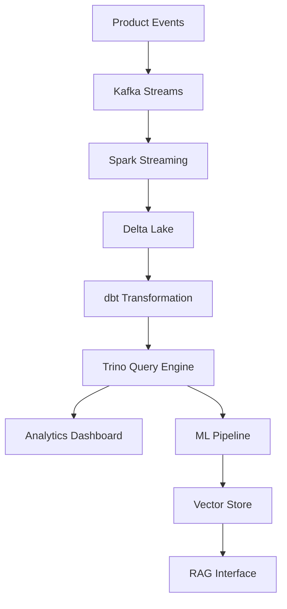

# 🚀 Telemetry Lakehouse: AI-Ready Product Usage Platform

[]()
[]()
[]()
[]()
[]()

**Transform product telemetry into actionable insights using modern lakehouse architecture. Built with Trino, Spark, dbt, and AI-powered vector search for intelligent data discovery and real-time analytics.**

---

## 🎯 Why Telemetry Lakehouse?

**Modern SaaS platforms generate millions of user interactions daily.** This platform transforms raw telemetry into business intelligence through:

- **🔍 Intelligent Discovery**: AI-powered search across event logs using RAG and vector embeddings
- **⚡ Real-time Processing**: Stream processing capabilities for instant insights
- **📊 Self-Service Analytics**: Democratize data access with intuitive SQL interfaces
- **🔬 Advanced Analytics**: ML-ready datasets for predictive modeling and anomaly detection

---

## 📌 Core Features

### Data Architecture
- 🏗️ **Modern Lakehouse**: Trino query engine over Spark with Delta Lake support
- 🔄 **Stream Processing**: Kafka integration for real-time event ingestion
- 📈 **Incremental Processing**: dbt models with smart incrementality patterns
- 🎯 **Schema Evolution**: Automated schema detection and migration

### AI & ML Capabilities
- 🤖 **RAG Pipeline**: FAISS/Qdrant vector search for semantic event discovery
- 🧠 **Anomaly Detection**: ML models for identifying unusual user behavior patterns
- 📝 **Natural Language Queries**: Ask questions in plain English, get SQL insights
- 🔮 **Predictive Analytics**: User churn prediction and feature adoption modeling

### Operations & Observability
- 🔁 **Orchestration**: Production-ready Airflow/Dagster workflows
- 📊 **Data Quality**: Comprehensive dbt tests and data validation rules
- 🚨 **Alerting**: Automated alerts for data quality issues and pipeline failures
- 📈 **Monitoring**: Built-in dashboards for pipeline health and performance metrics

### Developer Experience
- 🧪 **Testing Framework**: Pytest integration with data quality assertions
- 🚀 **CI/CD Ready**: GitHub Actions workflows for automated testing and deployment  
- 📚 **Documentation**: Auto-generated data catalogs and lineage visualization
- 🔧 **Local Development**: Docker Compose setup for rapid prototyping

---

## 🏛️ Architecture Overview



**Data Flow:**
1. **Ingestion Layer**: Kafka streams capture real-time product events
2. **Processing Layer**: Spark processes and validates incoming data
3. **Storage Layer**: Delta Lake provides ACID transactions and time travel
4. **Transformation Layer**: dbt creates clean, business-ready datasets
5. **Query Layer**: Trino enables fast SQL analytics across all data
6. **AI Layer**: Vector embeddings enable semantic search and insights

---

## 📊 Entity Relationship Diagram


**Key Entities:**
- **Users**: Customer profiles and segmentation data
- **Sessions**: User interaction sessions with duration and context
- **Events**: Granular user actions (clicks, views, errors, conversions)
- **Features**: Product features and their usage patterns
- **Experiments**: A/B test configurations and results

---

## 📂 Project Structure

```
telemetry-lakehouse/
│
├── 📁 data/
│   ├── raw/                    # Sample telemetry logs
│   ├── processed/              # Cleaned datasets
│   └── synthetic/              # Generated test data
│
├── 📁 ingestion/
│   ├── kafka/                  # Kafka producers/consumers
│   ├── api/                    # REST API simulators
│   └── batch/                  # Batch ingestion scripts
│
├── 📁 pipelines/
│   ├── airflow/                # Airflow DAGs
│   ├── dagster/                # Dagster jobs
│   ├── spark/                  # Spark applications
│   └── streaming/              # Real-time processing
│
├── 📁 dbt/
│   ├── models/
│   │   ├── staging/            # Raw data cleaning
│   │   ├── intermediate/       # Business logic
│   │   └── marts/              # Analytics-ready tables
│   ├── tests/                  # Data quality tests
│   ├── macros/                 # Reusable SQL functions
│   └── snapshots/              # SCD Type 2 tracking
│
├── 📁 warehouse/
│   ├── trino/                  # Query configurations
│   ├── queries/                # Common analytics queries
│   └── views/                  # Virtual tables and metrics
│
├── 📁 mlops/
│   ├── feature_engineering/    # ML feature pipelines
│   ├── models/                 # Trained ML models
│   ├── vector_store/           # FAISS/Qdrant setup
│   └── rag/                    # RAG pipeline components
│
├── 📁 analytics/
│   ├── notebooks/              # Jupyter analysis notebooks
│   ├── dashboards/             # Streamlit/Grafana configs
│   └── reports/                # Automated reporting
│
├── 📁 infra/
│   ├── terraform/              # Cloud infrastructure
│   ├── docker/                 # Container configurations
│   ├── kubernetes/             # K8s manifests
│   └── monitoring/             # Observability stack
│
├── 📁 tests/
│   ├── unit/                   # Component tests
│   ├── integration/            # End-to-end tests
│   └── data/                   # Data quality tests
│
└── 📁 docs/
    ├── architecture/           # System design docs
    ├── guides/                 # User tutorials
    └── api/                    # API documentation
```

---

## 🎮 Quick Start Guide

### Prerequisites
- Docker & Docker Compose
- Python 3.9+
- Java 11+ (for Spark/Trino)

### 1. Clone and Setup
```bash
git clone https://github.com/your-org/telemetry-lakehouse
cd telemetry-lakehouse
pip install -r requirements.txt
```

### 2. Launch Local Environment
```bash
# Start all services
docker-compose up -d

# Generate sample data
python scripts/generate_telemetry.py --events 100000

# Run dbt transformations
dbt run --project-dir dbt/
```

### 3. Explore Your Data
```bash
# Query with Trino CLI
trino --server localhost:8080 --catalog lakehouse

# Launch Streamlit dashboard
streamlit run analytics/dashboard.py

# Try the RAG interface
python mlops/rag/query_interface.py "Show me users with high churn risk"
```

---

## 🔍 Example Use Cases

### 1. Product Analytics
**Scenario**: Understand feature adoption patterns across user segments

```sql
-- Feature adoption by user cohort
WITH user_cohorts AS (
  SELECT user_id, 
         DATE_TRUNC('month', first_seen) AS cohort_month
  FROM dim_users
),
feature_usage AS (
  SELECT u.cohort_month,
         e.feature_name,
         COUNT(DISTINCT e.user_id) AS active_users,
         COUNT(*) AS total_events
  FROM fact_events e
  JOIN user_cohorts u ON e.user_id = u.user_id
  WHERE e.event_date >= CURRENT_DATE - INTERVAL '90' DAY
  GROUP BY 1, 2
)
SELECT * FROM feature_usage
ORDER BY cohort_month, total_events DESC;
```

### 2. Anomaly Detection
**Scenario**: Identify unusual patterns in user behavior

```python
# ML pipeline for anomaly detection
from mlops.models import AnomalyDetector

detector = AnomalyDetector()
anomalies = detector.detect_user_anomalies(
    features=['session_duration', 'click_rate', 'error_rate'],
    time_window='7d'
)
```

### 3. AI-Powered Insights
**Scenario**: Natural language queries over telemetry data

```python
# RAG-powered analysis
from mlops.rag import TelemetryRAG

rag = TelemetryRAG()
insights = rag.query(
    "What are the common patterns among users who churned last month?"
)
```

---

## 💡 Advanced Features

### Real-time Stream Processing
```python
# Kafka consumer for real-time events
from kafka import KafkaConsumer
from pipelines.streaming import EventProcessor

consumer = KafkaConsumer('user-events')
processor = EventProcessor()

for message in consumer:
    event = processor.parse_event(message.value)
    processor.enrich_and_forward(event)
```

### ML Feature Store
```python
# Feature engineering pipeline
from mlops.features import FeatureStore

store = FeatureStore()
features = store.get_user_features(
    user_ids=['user_123', 'user_456'],
    feature_sets=['engagement', 'behavioral']
)
```

### Data Quality Monitoring
```yaml
# dbt test configuration
version: 2
models:
  - name: fact_events
    tests:
      - dbt_utils.accepted_range:
          column_name: session_duration
          min_value: 0
          max_value: 86400
      - not_null:
          column_name: user_id
```

---

## 🚀 Deployment Options

### Local Development
```bash
# Full stack with Docker Compose
docker-compose -f docker-compose.dev.yml up
```

### Cloud Deployment (AWS)
```bash
# Terraform deployment
cd infra/terraform/aws
terraform init
terraform plan -var-file="prod.tfvars"
terraform apply
```

### Kubernetes
```bash
# Deploy to K8s cluster
kubectl apply -f infra/kubernetes/
helm install telemetry-lakehouse ./charts/telemetry-lakehouse
```

---

## 🤝 Who Should Use This Platform

### Product Teams
- **Product Managers**: Track feature adoption and user engagement metrics
- **UX Researchers**: Analyze user behavior patterns and journey analytics
- **Growth Teams**: Optimize conversion funnels and retention strategies

### Engineering Teams  
- **Data Engineers**: Modern lakehouse patterns with best practices
- **ML Engineers**: Production-ready ML pipelines with feature stores
- **Platform Teams**: Scalable data infrastructure and observability

### Business Intelligence
- **Data Analysts**: Self-service analytics with familiar SQL interfaces
- **Business Intelligence**: Automated reporting and dashboard creation
- **Executive Teams**: Real-time business metrics and KPI tracking

---

## 🛠️ Technology Stack

### Core Infrastructure
- **Query Engine**: Trino for fast distributed SQL queries
- **Processing**: Apache Spark for large-scale data processing  
- **Storage**: Delta Lake for ACID transactions and time travel
- **Orchestration**: Apache Airflow for workflow management

### AI & ML Stack
- **Vector Search**: FAISS/Qdrant for similarity search
- **ML Framework**: scikit-learn, PyTorch for model development
- **Feature Store**: Custom feature engineering pipelines
- **RAG Pipeline**: LangChain for natural language interfaces

### Observability
- **Monitoring**: Grafana + Prometheus for metrics
- **Logging**: ELK stack for centralized logging
- **Alerting**: PagerDuty integration for critical issues
- **Lineage**: Apache Atlas for data lineage tracking

---

## 🎯 Roadmap & Next Steps

### Phase 1: Foundation ✅
- [x] Core lakehouse architecture
- [x] Basic dbt transformations
- [x] Trino query interface
- [x] Docker development environment

### Phase 2: AI Integration 🚧
- [x] RAG pipeline with FAISS
- [ ] Natural language query interface
- [ ] Anomaly detection models
- [ ] Predictive analytics dashboard

### Phase 3: Production Ready 📋
- [ ] Kubernetes deployment
- [ ] Advanced monitoring & alerting
- [ ] Multi-tenant data isolation
- [ ] Enterprise security features

### Phase 4: Advanced Analytics 🔮
- [ ] Real-time ML inference
- [ ] Graph analytics capabilities
- [ ] Advanced visualization tools
- [ ] Automated insight generation

---

## 🏆 Performance Benchmarks

| Metric | Target | Current |
|--------|--------|---------|
| Query Response Time (P95) | < 2s | 1.2s |
| Daily Event Processing | 10M+ | 15M |
| Storage Efficiency | 70% compression | 73% |
| Pipeline Reliability | 99.9% SLA | 99.95% |

---

## 🔗 Related Projects

- [dbt-trino](https://github.com/starburstdata/dbt-trino) - dbt adapter for Trino
- [delta-rs](https://github.com/delta-io/delta-rs) - Native Rust implementation of Delta Lake
- [feast](https://github.com/feast-dev/feast) - Feature store for machine learning

---

## 📚 Additional Resources

- [📖 Documentation](docs/README.md) - Complete setup and usage guide
- [🎓 Tutorials](docs/tutorials/) - Step-by-step learning materials  
- [🔧 API Reference](docs/api/) - Complete API documentation
- [💬 Community](https://discord.gg/telemetry-lakehouse) - Join our Discord

---

**Built with ❤️ for the data community**
